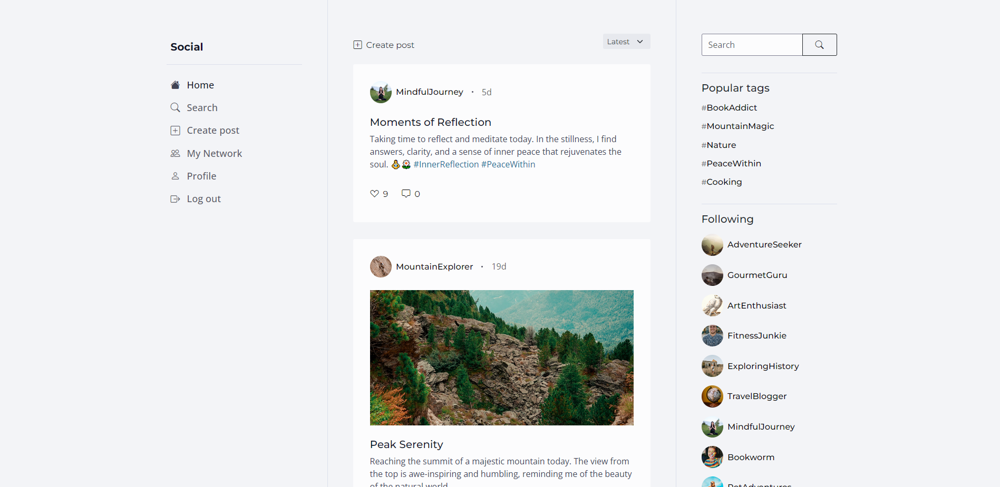

# css-frameworks-ca



This project was created to work with bootstrap and sass.

## Built With

You can list a the tech stack that you've used over here

- [Sass](https://sass-lang.com/)
- [Bootstrap](https://getbootstrap.com)

## Getting Started

### Installing

1. Clone the repo:

```bash
git clone git@github.com:martekn/css-frameworks-ca.git
```

2. Install the dependencies:

```
npm install
```

### Running

To run the app, run the following commands:

```bash
npm run watch
```
